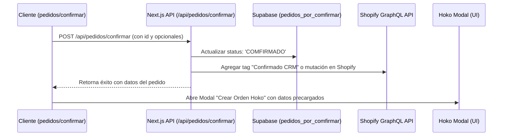

# Plan de Implementación: Confirmación con Shopify y Modal Hoko

Este plan detalla el flujo completo para automatizar la confirmación de pedidos en Shopify, marcarlos localmente como `'COMFIRMADO'` y abrir un modal de creación de orden en Hoko.

## Flujo Propuesto

## Propuesta de Cambios

### 1. Backend (`/api/pedidos/confirmar/route.ts`)

#### [MODIFY] [route.ts](file:///c:/Users/Usuario/Desktop/Proyectos/crm/src/app/api/pedidos/confirmar/route.ts)
* Modificar el endpoint `POST` para que además de actualizar la tabla en Supabase, envíe un tag de confirmación (`Confirmado CRM`) o actualice el metadato en la orden de Shopify vinculada (`shopify_order_id`) usando la API GraphQL de Shopify.

### 2. Frontend (`/pedidos/confirmar/page.tsx`)

#### [MODIFY] [page.tsx](file:///c:/Users/Usuario/Desktop/Proyectos/crm/src/app/(dashboard)/pedidos/confirmar/page.tsx)
* Diseñar e implementar un modal interactivo **`HokoOrderCreateModal`** que se abrirá automáticamente después de que la API de confirmación responda con éxito.
* Este modal vendrá pre-diligenciado con la información del pedido confirmando (Destinatario, Teléfono, Dirección, Ciudad, Cantidad, Producto Stock y valor de cotización de transportadora).
* Permite al operador confirmar los detalles, el stock y la transportadora y realizar el envío para **Crear la Orden en Hoko** (sin gatillar el paso de generación de guía física aún).

## Plan de Verificación

### Pruebas Manuales
1. Entrar en la sección **Pedidos por Confirmar**.
2. Hacer clic en **Confirmar** en un pedido de Shopify o Chat.
3. Verificar que se llame la API, se actualice en Supabase y de inmediato se abra el modal interactivo de Hoko para la creación del pedido.
